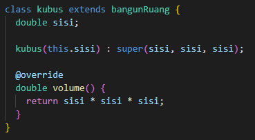
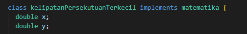

Materi – Deep Dive Into Dart Object Oriented Programming

1. **Constructor (Konstruktor)**:
   - Konstruktor adalah method dalam sebuah kelas yang digunakan untuk menginisialisasi objek dari kelas tersebut. Dapat menerima parameter serta tidak memiliki return.
  
2. **Inheritance (Pewarisan)**:
   - Sebuah kelas dapat mewarisi sifat-sifat (properti dan metode) dari kelas lain.
   - penulisannya menggunakan extends
   CONTOH :
   

3. **Method Overriding (Penggantian Metode)**:
   - Menulis ulang method yang ada pada super-class.Tujuannya agar class memiliki method yang sama dengan proses yang berbeda
   - Overriding dilakukan pada class anak, penggunaannya menggunakan @override

4. **Interface (Antarmuka)**:
   - Pada interface, semua method wajib menggunakan override
   - penulisannya menggunakan implements
   CONTOH : 
   

5. **Abstract Class (Kelas Abstrak)**:
   - Kelas abstrak adalah kelas yang tidak dapat dijadikan object
   - digunakan menggunakan extends
   - Dalam penggunaannya saat di extends ke kelas lain, tidak semua method harus di override

6. **Polymorphism (Polimorfisme)**:
   - Polimorfisme adalah konsep di mana sebuah objek dapat memiliki banyak bentuk atau tipe yang berbeda.
   - tipe data yang digunakan yaitu super class dan digunakan menggunakan extends atau implements

7. **Generics (Generik)**:
   - dapat menerima data dengan tipe data berbeda

8. **Encapsulation (Enkapsulasi)**:
   Dengan enkapsulasi, data dalam sebuah objek hanya dapat diakses melalui metode yang telah ditentukan
