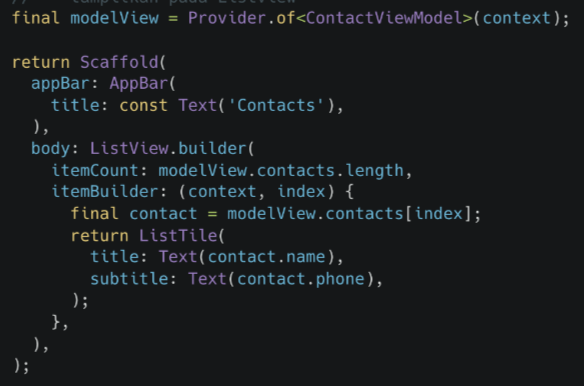
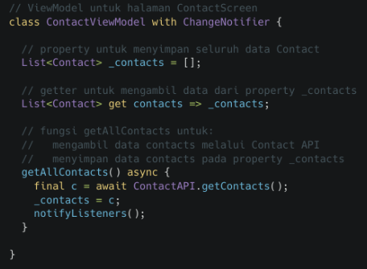

Summary Materi MVVM

* MVVM (Model-View View Model) memisahkan logic dengan tampilan (view) ke dalam view model
* Keuntungan :
    - Jika ada beberapa tampilan yang memerlukan alur logic yang sama, mereka bisa menggunakan ViewModel yang sama
    - Mudah dirawat karena pekerjaan terkait tampilan tidak tertumpuk bersama logic
    - Pengujian menjadi terpisah antara pengujian tampilan dengan pengujian logic sehingga dapat meingkatkan produktivitas pada pengujian 

* Implementasi MVVM 
    - Model memiliki 2 bagian, yaitu bentuk data yang akan digunakan dan sumber dari data tersebut. contoh :
    -- Model
    --- api
        --- contact_api.dart
    --- contact_model.dart

    - Tiap screen diletakkan dalam sebuah direktori yang di dalamnya terdapat view dan view model. contoh :
    -- Screen
    --- Contact
        --- contact_screen.dart
        --- contact_view_model.dart

* struktur mvvm 
    1. Model (bentuk data yang digunakan)
        Ex :
        class Contact {
            final String name;
            final String phone;

            Contact({
                required this.name,
                required this.phone,
            });
        }

    2. UI dan logic :
        - View (UI)
            Ex : 
            

        - View Model (Logic)
            Ex : 
            
    

